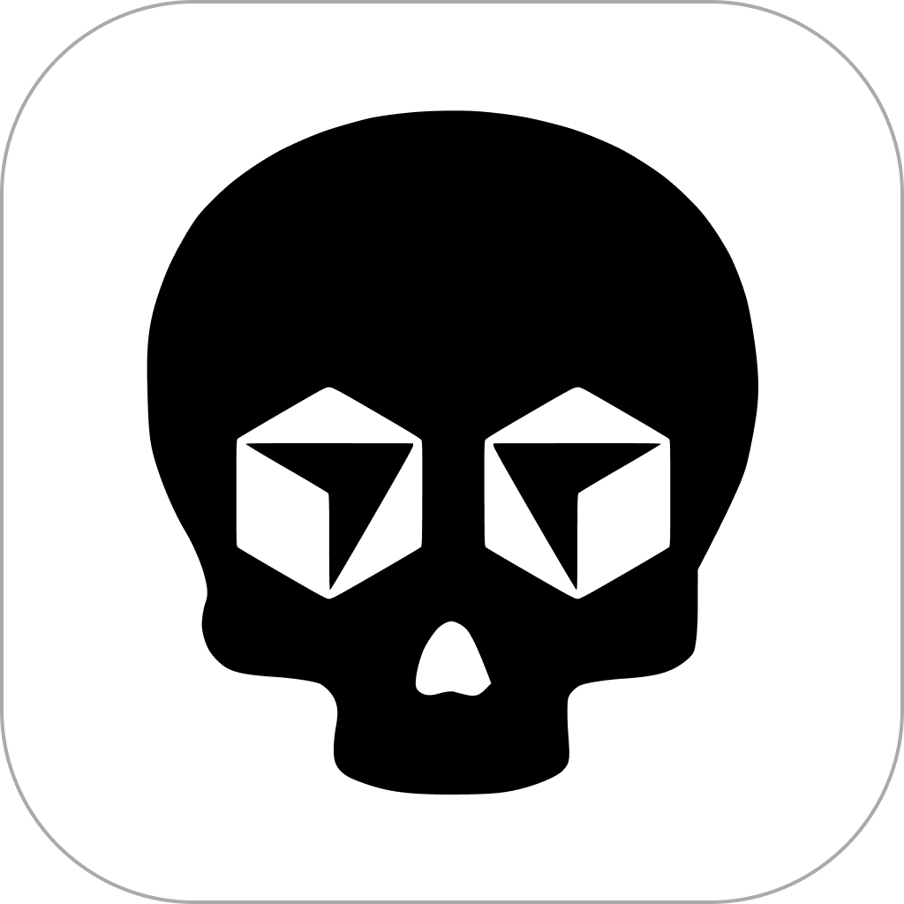

<div align="left">
  
</div>

# Kill Cursor - macOS Status Bar App

A simple macOS application that appears in the Status Bar and allows you to completely close Cursor IDE.

## Why This App Exists

This app was created to solve a problem: even after quitting Cursor IDE, it continues running in the background and consumes significant battery power. This issue particularly occurs when running processes with tmux or similar terminal multiplexers. Kill Cursor allows you to completely terminate all Cursor processes with a single click, preventing unnecessary battery drain.

## Features

- **Status Bar Integration**: Appears in the macOS Status Bar with live Cursor status indicator
- **One-Click Kill**: Kill all Cursor processes (including Helper, Renderer, GPU, Plugin) with a single click
- **Global Hotkey**: Press `⌘⇧K` from anywhere to kill Cursor instantly
- **Dark/Light Mode Support**: Automatically switches icons based on macOS appearance
- **Notifications**: Shows notifications when Cursor is killed, not found, or permission denied
- **Launch at Login**: Optionally start KillCursor when you log in
- **Live Status**: Shows whether Cursor is currently running in the menu
- **Keyboard Shortcuts**: 
  - `⌘⇧K` - Kill Cursor (global, works from any app)
  - `K` - Kill Cursor (from menu)
  - `Q` - Quit application
- **About Menu**: View app information and credits

## Installation

1. Clone or download this repository

2. Run the build script:
```bash
chmod +x build.sh
./build.sh
```

3. Run the application:
```bash
open build/KillCursor.app
```

4. (Optional) Move the app to Applications folder:
```bash
cp -r build/KillCursor.app /Applications/
```

## Usage

- **Kill Cursor**: Press `⌘⇧K` from anywhere, or click the status bar icon and select "Kill Cursor"
- **Status**: The menu shows whether Cursor is currently running (● running / ○ not running)
- **Launch at Login**: Toggle from the menu to auto-start KillCursor on login
- **About**: Select "About Kill Cursor" from the menu to view app information
- **Quit**: Select "Quit" from the menu (or press `Q`)

## Requirements

- macOS 11.0 or later
- Swift compiler

## Compatibility

- Builds as a **Universal Binary** (Intel + Apple Silicon)
- Runs natively on both Intel and M-series Macs

## Technical Details

- The application runs in the background (LSUIElement = true)
- Kills all Cursor-related processes: Cursor, Cursor Helper, Cursor Helper (Renderer/GPU/Plugin)
- Pre-checks process existence with `pgrep` before attempting kill
- Distinguishes between "not found", "permission denied", and other errors
- Status bar icons automatically adapt to dark/light mode
- Polls Cursor process status every 5 seconds
- Global hotkey via `NSEvent.addGlobalMonitorForEvents`
- Launch at Login via `SMAppService` (macOS 13+) with legacy fallback
- Ad-hoc code signed for easier distribution

## Icon Files

The app uses custom icons:
- `icon-dark.png` - Status bar icon for dark mode
- `icon-light.png` - Status bar icon for light mode
- `AppIcon.icon/Assets/skull.png` - Application icon

## License

This project is open source and available under the MIT License.

## Author

**Ahmet Bugra Avcilar**

- Website: [https://ahm.et](https://ahm.et)
- Year: 2025
